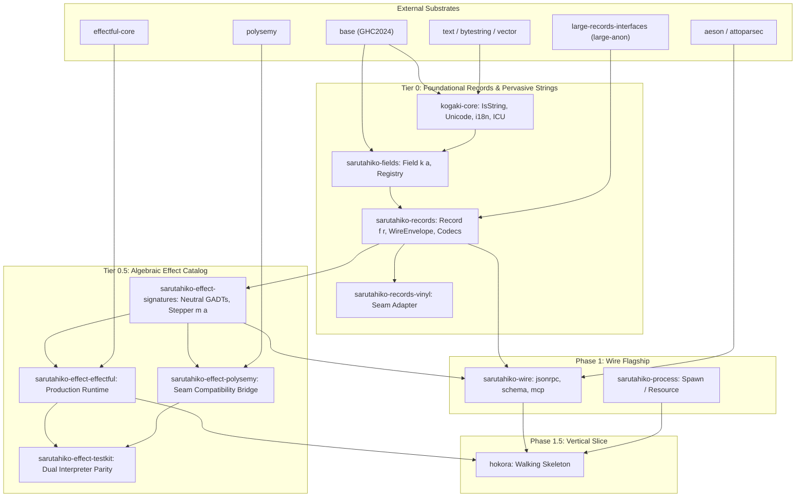

# Phase 0 Implementation Plan — Foundations, Spikes & Task Packets

Status: COMPLETED · 2026-09-25 — The operational work breakdown structure (WBS)
and hermetic task packets for Phase 0 execution.
Related: `NIH_PLAN.md` (§2 package map, §3.3 wire contracts, §4 roadmap),
`FIELDS_RECORDS_DESIGN.md` (HKD, evolution E1–E7, combinators),
`EFFECT_CATALOG_DESIGN.md` (signatures, Stepper m a, Handlers-as-Records spike §6.2),
`YAMAARASHI_DESIGN.md` (church-encoded kernel), `KOGAKI_DESIGN.md` (extraction doctrine),
`INFRASTRUCTURE.md` (toolchain, warnings, test matrix, git trailers),
`CODE_OF_CONDUCT.md` (community covenant 3.0),
`transcripts/kogaki-i18n-unicode.md` (provenance context).

**Thesis.** A comprehensive architectural design is only as effective as its translation
into verifiable code. To enable mechanical execution—whether driven by human maintainers,
paired programming, or autonomous AI coding assistant drivers (such as the Arena driver
in `typed-language-model-arena` or standalone CLI agents)—this plan decomposes Phase 0
into discrete, hermetic **Task Packets**.

Drawing on the intellectual heritage of Lennart Augustsson's **Djinn** (where complete type
specifications turn implementation into deterministic Curry-Howard synthesis), each task
packet specifies exact GADTs, module paths, laws, compiler flags, and deterministic
verification commands. Ambiguity is reduced to zero.

---

## 0. The Five Pre-Implementation Closures

Before code is written, five specific design closures are formally settled:

### Closure 1: The Phase 0 Cabal & Multi-Package Blueprint
The repository transitions from a single placeholder `sarutahiko.cabal` to a multi-package
`cabal.project` root managing the foundational packages:

```
sarutahiko/
├── cabal.project                          # Multi-package project configuration
├── cabal.project.freeze                   # Pinned dependency freeze file
├── packages/
│   ├── kogaki-core/                       # Tier-0: Pervasive string, Unicode normalization & i18n
│   ├── sarutahiko-fields/                 # Tier-0: First-class field datums & registry
│   ├── sarutahiko-records/                # Tier-0: HKD, envelopes, combinators, codecs
│   ├── sarutahiko-records-vinyl/          # Tier-0: Seam-only vinyl compatibility adapter
│   ├── sarutahiko-effect-signatures/      # Tier-0.5: Neutral effect GADTs & Stepper m a
│   ├── sarutahiko-effect-effectful/       # Tier-0.5: Effectful production interpreter bridge
│   ├── sarutahiko-effect-polysemy/        # Tier-0.5: Polysemy seam compatibility bridge
│   └── sarutahiko-effect-testkit/         # Tier-0.5: Parity testkit & law suites
```

#### Shared Cabal Commons
Every package imports a shared `cabal.project` stanza:
- **Default Language:** `GHC2024`
- **Compiler Warnings:** `-Wall -Wcompat -Widentities -Wincomplete-record-updates -Wincomplete-uni-patterns -Wmissing-home-modules -Wpartial-fields -Wredundant-constraints -Werror` (in CI)
- **Record Foundation:** Local dependency on the canonical maintainer fork `large-records-interfaces` (`large-anon ^>= 0.3`).

#### Component & Package Dependency Graph
The internal architecture stratifies into strictly ordered tiers to prevent dependency leakage:



#### Package Sequencing & Stratification Principles

1. **The Pervasive String/i18n Substrate (`kogaki-core`):**
   Strings in an agent ecosystem (prompts, tool calls, JSON keys, log envelopes, terminal text)
   are pervasive. Rather than treating internationalization as a late-stage application concern,
   `kogaki-core` sits immediately above `base:Data.String(IsString(..))` and `text`. It establishes
   NFC/NFD normalization, grapheme-cluster indexing, and locale message catalogs at the bedrock.
   Every field name in `sarutahiko-fields` and every error envelope in `sarutahiko-records` is
   grounded in this canonical text representation.

2. **Codecs Stratification (Preventing Upstream Inundation):**
   Adequacy for real-world agent protocols requires pulling in extensive format and protocol codecs
   (`aeson`, `attoparsec`, `scientific`, CBOR, SSE, JSON-RPC, MCP). These codecs are strictly
   sequenced into Phase 1 (`sarutahiko-jsonrpc`, `sarutahiko-schema`, `sarutahiko-mcp`). Tier 0
   (`sarutahiko-records`) defines generic vector decoders and `WireEnvelope` combinators, but
   remains unpolluted by high-churn network protocol schemas.

3. **The Vinyl Compatibility Strategy for Polysemy:**
   The architectural posture established for records governs our effect runtime integration:
   - **Internal Ground Truth:** `large-anon` is the sole internal record representation, and
     `sarutahiko-effect-effectful` is our primary high-performance production runtime.
   - **Compatibility at the Seams:** `vinyl` is supported strictly via `sarutahiko-records-vinyl`
     for third parties. Mirroring this, `sarutahiko-effect-polysemy` is an external/seam compatibility
     target. It projects our neutral GADTs into Polysemy's open unions (`Union r (m a)`) using
     vinyl-like type-level projection combinators. Polysemy's higher-order `Weaving` or type-list
     overhead never leaks into core signatures, the streaming kernel, or production hot loops.

---

### Closure 2: The Handlers-as-Records Spike Specification
Per `EFFECT_CATALOG_DESIGN.md` §6.2, Phase 0 executes an empirical spike before committing
handler representations:

- **The Spike GADT:**
  ```haskell
  data KeyValue (m :: Type -> Type) :: Type -> Type where
    GetKV :: !Text -> KeyValue m (Maybe Text)
    PutKV :: !Text -> !Text -> KeyValue m ()
  ```
- **The Spike Handler Record:**
  ```haskell
  type KeyValueHandler m = Record Identity
    '[ "getKV" ':= Text -> m (Maybe Text)
     , "putKV" ':= Text -> Text -> m ()
     ]
  ```
- **Quantitative Gate:**
  A Criterion benchmark runs $10^6$ operations under both `effectful` and `polysemy`:
  - *Branch A (Pass):* If record-merged dynamic dispatch introduces $\le 5\%$ latency
    overhead compared to handwritten pattern-matching interpreters, handlers-as-records
    is adopted program-wide.
  - *Branch B (Fallback):* If overhead exceeds $5\%$ or requires excessive type-level
    coercions, the program immediately adopts handwritten dual-interpreter bridges.

---

### Closure 3: The Minimal Core Signature Kernel
`EFFECT_CATALOG_DESIGN.md` specifies 14 signatures. For Phase 0 and Phase 1, only the
following 6 signatures are admitted into the initial kernel:

| Priority | Signature | Role in Walking Skeleton |
|---|---|---|
| **P0.1** | `Resource` / `Scoped` | Deterministic bracketing, transaction regions, cursor lifetimes |
| **P0.2** | `Clock` | Monotonic timestamps for lease timeouts and latency metrics |
| **P0.3** | `Process` | Subprocess invocation for MCP tools and local LLM CLIs |
| **P0.4** | `Log` | Structured telemetry carrying `SomeRow` envelopes |
| **P1.1** | `SessionStore` | Skinny Spine SQLite append writer for Hokora v0.2 events |
| **P1.2** | `ModelAPI` | `utai-mock` and SSE streaming completions |

All other signatures (`Database` full AST, `EventBus`, `HookDispatch`, `PolicyEffect`,
`Telemetry`, `Git`, `FileSystem`) are deferred to Phase 2+.

---

### Closure 4: The Kogaki Tokenizer Specification
Per `LLM_SUBSTRATE_DESIGN.md` §2 and `KOGAKI_DESIGN.md`, token counting for `ModelAPI`
(`Count :: ContextRow -> ModelAPI m TokenCount`) must be fast, offline, and deterministic:
- Network calls to provider APIs are prohibited in tight turn loops.
- Heuristic character ratios ($4 \text{ chars} \approx 1 \text{ token}$) are prohibited due
  to `ANT-010` overflow risks.
- **Decision:** In Phase 0, `sarutahiko-model-tokenizer` extracts the `cl100k_base` and
  `o200k_base` BPE merge ranks at build time into a static `SmallArray#` lookup vector.
  A pure-Haskell byte-pair encoder runs offline in sub-millisecond time.

---

### Closure 5: The Hokora MCP Wire & Fixture Manifest
To guarantee that Phase 1.5 exit criteria are unambiguously verifiable by automated test
runners, the exact wire sequence for the Hokora tracer bullet is fixed in
`test/fixtures/wire/mcp/hokora-turn.jsonl`:

1. **Client Init:** `{"jsonrpc":"2.0","id":1,"method":"initialize","params":{"protocolVersion":"2024-11-05","capabilities":{}}}`
2. **Server Init Resp:** `{"jsonrpc":"2.0","id":1,"result":{"protocolVersion":"2024-11-05","capabilities":{"tools":{}}}}`
3. **Client Tools List:** `{"jsonrpc":"2.0","id":2,"method":"tools/list","params":{}}`
4. **Server Tools Resp:** `{"jsonrpc":"2.0","id":2,"result":{"tools":[{"name":"echo","description":"Echo input","inputSchema":{"type":"object","properties":{"msg":{"type":"string"}}}}]}}`
5. **Client Tool Call:** `{"jsonrpc":"2.0","id":3,"method":"tools/call","params":{"name":"echo","arguments":{"msg":"hello"}}}`
6. **Server Tool Resp:** `{"jsonrpc":"2.0","id":3,"result":{"content":[{"type":"text","text":"hello"}]}}`

---

## 1. The Hermetic Task Packets (Work Breakdown Structure)

The following six task packets represent the sequential execution units of Phase 0.
Each packet is self-contained and verifiable via deterministic CLI commands.

```
┌────────────────────────────────────────────────────────────────────────────────────────┐
│                                 PHASE 0 TASK PACKETS                                   │
├────────────┬─────────────────────────────┬──────────────────────────────────┬──────────┤
│ Packet ID  │ Target Scope                │ Deliverables                     │ Status   │
├────────────┼─────────────────────────────┼──────────────────────────────────┼──────────┤
│ **TP-0.1** │ Project Root & Scaffolding  │ `cabal.project`, commons stanza, │ COMPLETE │
│            │                             │ directory stubs                  │          │
├────────────┼─────────────────────────────┼──────────────────────────────────┼──────────┤
│ **TP-0.2** │ `sarutahiko-fields`         │ First-class field datums,        │ COMPLETE │
│            │                             │ witnesses, CD1–CD2 registry      │          │
├────────────┼─────────────────────────────┼──────────────────────────────────┼──────────┤
│ **TP-0.3** │ `sarutahiko-records`        │ HKD `TriState`, `WireEnvelope`,  │ COMPLETE │
│            │                             │ `(⊕)` merge, 40-col bench        │          │
├────────────┼─────────────────────────────┼──────────────────────────────────┼──────────┤
│ **TP-0.4** │ Spike Execution             │ Handlers-as-Records Criterion    │ COMPLETE │
│            │                             │ benchmark & adjudication         │          │
├────────────┼─────────────────────────────┼──────────────────────────────────┼──────────┤
│ **TP-0.5** │ `effect-signatures`         │ The Minimal Core GADTs & Stepper │ COMPLETE │
├────────────┼─────────────────────────────┼──────────────────────────────────┼──────────┤
│ **TP-0.6** │ Dual Interpreter Bridges    │ `effectful` & `polysemy` parity  │ COMPLETE │
│            │                             │ testkit in CI                    │          │
└────────────┴─────────────────────────────┴──────────────────────────────────┴──────────┘
```

---

### Task Packet TP-0.1: Project Root & Scaffolding

- **Objective:** Establish the multi-package `cabal.project` build graph and link the
  local `large-records-interfaces` fork.
- **Files to Create/Modify:**
  - `cabal.project`
  - `packages/sarutahiko-fields/sarutahiko-fields.cabal`
  - `packages/sarutahiko-records/sarutahiko-records.cabal`
  - `packages/sarutahiko-effect-signatures/sarutahiko-effect-signatures.cabal`
- **Verification Commands:**
  ```bash
  cabal update
  cabal build all --dry-run
  ```
- **Exit Criteria:** `cabal build all` successfully configures all three foundational
  package stubs without version conflicts.

---

### Task Packet TP-0.2: `sarutahiko-fields` (Field Datum & Registry)

- **Objective:** Implement first-class field datums satisfying contracts CD1–CD2 from
  `FIELDS_RECORDS_DESIGN.md` §3.
- **Files to Create:**
  - `packages/sarutahiko-fields/src/Sarutahiko/Fields/Datum.hs`
  - `packages/sarutahiko-fields/src/Sarutahiko/Fields/Witness.hs`
  - `packages/sarutahiko-fields/src/Sarutahiko/Fields/Registry.hs`
  - `packages/sarutahiko-fields/test/Main.hs`
- **Grounded Types to Implement:**
  ```haskell
  data FieldDatum (s :: Symbol) (a :: Type) = FieldDatum
    { fdSymbol      :: !(Proxy s)
    , fdIntroVer    :: !SchemaVersion
    , fdDeprecation :: !(Maybe Deprecation)
    , fdForOlder    :: !(ForOlder a)
    }
  ```
- **Associated Tests:**
  Hedgehog property suite verifying that all declared fields carry valid monotonic
  `SchemaVersion`s and total `ForOlder a` fallback provisions.
- **Verification Command:**
  ```bash
  cabal test sarutahiko-fields:tests
  ```

---

### Task Packet TP-0.3: `sarutahiko-records` (HKD, Envelopes & Combinators)

- **Objective:** Implement the blessed HKD functor family (`TriState`), wire envelopes,
  and the right-biased override merge combinator `(⊕)`.
- **Files to Create:**
  - `packages/sarutahiko-records/src/Sarutahiko/Records/HKD/TriState.hs`
  - `packages/sarutahiko-records/src/Sarutahiko/Records/Envelope.hs`
  - `packages/sarutahiko-records/src/Sarutahiko/Records/Combinators.hs`
  - `packages/sarutahiko-records/test/Laws/CombinatorLaws.hs`
  - `packages/sarutahiko-records/bench/CompileTime40Col.hs`
- **Grounded Laws to Verify (Hedgehog):**
  - **CA1–CA3:** `TriState` three-state distinction, projection naturality, and absence of
    provenance variants.
  - **E3–E4:** `WireEnvelope` preserves unparsed `envRawBytes`; re-serialization across a
    forward boundary throws `ForwardBoundaryReserializationForbidden`.
  - **(⊕) Laws:** Associativity, Identity, Idempotence, and Right Precedence.
- **Compile-Time Quality Gate:**
  `CompileTime40Col.hs` compiles a 40-column record; execution time is recorded in the
  nightly ledger.
- **Verification Commands:**
  ```bash
  cabal test sarutahiko-records:tests
  cabal bench sarutahiko-records:bench
  ```

---

### Task Packet TP-0.4: Handlers-as-Records Spike Execution

- **Objective:** Measure dynamic dispatch latency of handler records vs direct GADT
  interpreters under `effectful` and `polysemy`.
- **Files to Create:**
  - `packages/spikes/handlers-as-records/Spike.hs`
  - `packages/spikes/handlers-as-records/bench/Main.hs`
- **Harness & Benchmark:**
  Run Criterion benchmark over $10^6$ iterations of `GetKV` / `PutKV`.
- **Adjudication:**
  - Record percentage overhead in `docs/registers/REUSE_REGISTER.md`.
  - If $\le 5\%$, commit handler records as the standard pattern.
  - If $> 5\%$, adopt handwritten dual-interpreter bridges.
- **Verification Command:**
  ```bash
  cabal run spike-handlers-as-records-bench
  ```

---

### Task Packet TP-0.5: `sarutahiko-effect-signatures` (Core Kernel)

- **Objective:** Implement the 5 minimal GADT signatures and the canonical `Stepper m a`.
- **Files to Create:**
  - `packages/sarutahiko-effect-signatures/src/Sarutahiko/Effect/Stepper.hs`
  - `packages/sarutahiko-effect-signatures/src/Sarutahiko/Effect/Resource.hs`
  - `packages/sarutahiko-effect-signatures/src/Sarutahiko/Effect/Process.hs`
  - `packages/sarutahiko-effect-signatures/src/Sarutahiko/Effect/Clock.hs`
  - `packages/sarutahiko-effect-signatures/src/Sarutahiko/Effect/Log.hs`
- **Grounded Types:**
  ```haskell
  data Stepper m a where
    Stepper :: st -> (st -> m (Maybe (a, st))) -> (st -> m ()) -> Stepper m a
  ```
- **Verification Command:**
  ```bash
  cabal build sarutahiko-effect-signatures
  ```

---

### Task Packet TP-0.6: Dual Interpreter Bridges & Parity Gate

- **Objective:** Implement dual interpreters in `sarutahiko-effect-effectful` and
  `sarutahiko-effect-polysemy`, verified by a shared Tasty/Hedgehog parity testkit.
- **Files to Create:**
  - `packages/sarutahiko-effect-effectful/src/Sarutahiko/Effect/Interpreter/Effectful.hs`
  - `packages/sarutahiko-effect-polysemy/src/Sarutahiko/Effect/Interpreter/Polysemy.hs`
  - `packages/sarutahiko-effect-testkit/src/Sarutahiko/Effect/Testkit/Parity.hs`
  - `packages/sarutahiko-effect-testkit/test/Main.hs`
- **Parity Gate:**
  Assert that identical sequences of operations over `Clock`, `Process`, `Resource`, and
  `Log` yield identical results and state transitions under both runtimes.
- **Verification Command:**
  ```bash
  cabal test sarutahiko-effect-testkit:tests
  ```

---

## 2. Commit and Attribution Directives

All commits executing task packets must adhere to the updated repository conventions:
- **Format:** Descriptive-imperative subject, multi-line body explaining *why*, HEREDOC style.
- **Git Trailers:** Standard Linux kernel-style RFC 2822 trailers reflecting the actual driver:
  ```
  Assisted-by: Antigravity (Google DeepMind / Gemini 3.8)
  ```
  (or the appropriate driver and model in use, e.g. `Assisted-by: Codebuff (Z.AI / GLM-5.3)`).
- **Batching Policy:** Commits are strictly local. Pushes are batched at session end via
  `bin/push-all` per `AGENTS.md` and `INFRASTRUCTURE.md` §12.
